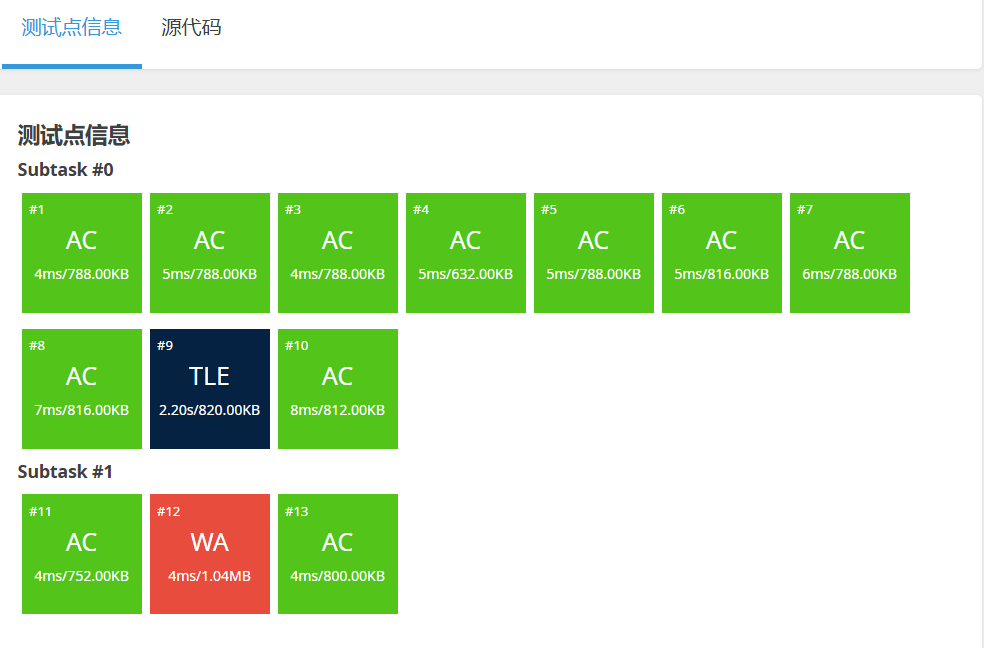

[[TOC]]

## 题目解析

## 代码 Bellman

@include-code(./bellman.cpp, cpp)

## 代码 spfa-dfs

在你去写这道题之前，我必须告诉你一个关于 **DFS-SPFA** 的残酷真相：

虽然 DFS-SPFA 在 **01分数规划**（如 P3199）中是神一般的存在（效率极高），但在 **纯负环模板题**（如 P3385）中，它很容易被“恶意数据”卡成 **TLE (超时)**。

- **原因**：出题人可以构造一种特殊的网格图，让 DFS 一头扎进去遍历指数级的路径，导致这一条路“走到黑”要走很久才能撞到尾巴。
- **对策**：如果你发现 TLE 了，不要怀疑你的算法逻辑（你的逻辑是对的）。为了过这道题，你可以尝试以下“玄学优化”：
  1. **打乱顺序**：在遍历节点 $1 \dots N$ 之前，用 `random_shuffle` 打乱顺序。
  2. **累加限制**：设置一个全局计数器，如果 DFS 调用次数超过一个巨大值（比如 $2 \times 10^7$），强行返回 `true`（这是一种赌博，赌它肯定有负环）。

**当然，如果你只想验证代码逻辑是否正确，即使 TLE 了也没关系，只要没有 WA (Wrong Answer) 就说明你的判环逻辑是对的。]

@include-code(./spfa-dfs.cpp, cpp)
