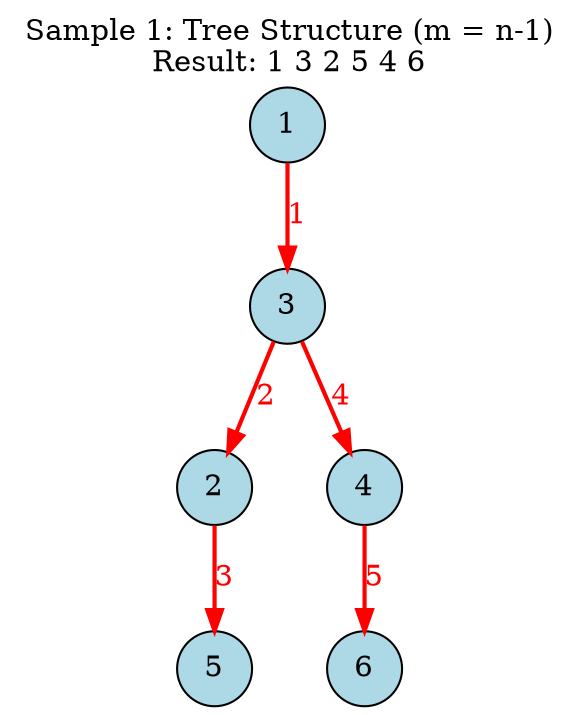
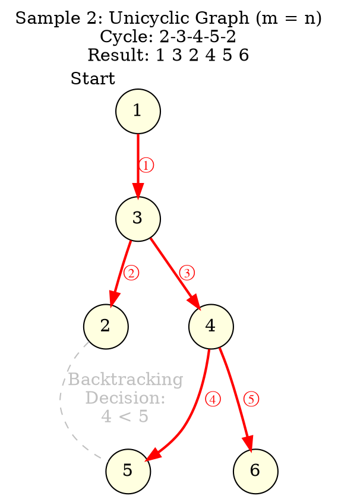
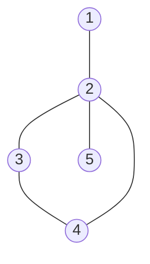

[[TOC]]

## 样例解析


### 样例 1：树 ($m=n-1$)

**输入：**
```text
6 5 
1 3 
2 3 
2 5 
3 4 
4 6
```

**分析：**
这是一个简单的树结构。
1. 起点固定为 1（为了字典序最小）。
2. 1 的邻居只有 3，去 3。
3. 3 的邻居有 2 和 4。**2 < 4**，先去 2。
4. 2 的邻居有 5。去 5。
5. 5 无路可走，回溯到 2，回溯到 3。
6. 3 的下一个邻居是 4。去 4。
7. 4 的邻居有 6。去 6。
**结果：** 1 3 2 5 4 6

#### Graphviz 图示 (Sample 1)

图中红色实线箭头表示**实际前进的路径**，数字标签表示访问顺序。



---

### 样例 2：基环树 ($m=n$)

**输入：**
```text
6 6 
1 3 
2 3 
2 5 
3 4 
4 5 
4 6
```

**分析：**
图包含一个环：**2-3-4-5-2**。
1. **1 -> 3**。
2. 在节点 3，邻居有 2 和 4。显然 **2 < 4**，先去 2。
3. 在节点 2，邻居有 5。
   *   *关键决策*：如果我们现在去 5，路径是 `1 3 2 5 ...`。
   *   如果我们**不去** 5（回溯），而是回到 3 走另一条路 4，路径是 `1 3 2 ... 4`。
   *   比较这两个选择：如果不走 2->5，下一次访问的新节点将是 4（从3走过去）。如果走 2->5，下一次是 5。
   *   因为 **4 < 5**，所以我们在节点 2 应该选择**回溯**，暂时放弃边 (2,5)。这相当于在逻辑上断开了环上的 (2,5) 边。
4. 回溯到 3，去 4。
5. 在节点 4，邻居有 5 和 6。**5 < 6**，去 5。
6. 在节点 5，邻居有 2，但 2 已访问，回溯。
7. 回到 4，去 6。
**结果：** 1 3 2 4 5 6

#### Graphviz 图示 (Sample 2)

图中展示了环结构。红色实线是实际生成的 DFS 树，**灰色虚线**表示那条存在但未被用来“首次访问”的边（即逻辑断开的边）。



### 关键逻辑解释

在图 2 中，最让人困惑的一步是：**为什么到了 2 之后不继续走到 5？**

这是因为这道题要求**字典序最小**。
当我们在环上时，我们实际上是在寻找一个位置“断开”环，使得生成的序列最优。
在节点 2 时，我们面临两个潜在的“下一个新节点”：
1. 直接走 (2, 5)，下一个记录的数是 **5**。
2. 回溯到 3，走 (3, 4)，下一个记录的数是 **4**。

因为 **4 < 5**，所以策略告诉我们：不要走 (2, 5)，赶紧回溯去走 (3, 4) 吧！这样我们就能在序列的更前面填入更小的数字 4。


## 题目解析

要从 **题目描述** 推导出“$m=n$ 等价于在一棵树上行走，实际上就是枚举删除环上的一条边”，我们需要理清以下三个逻辑链条：

### 1. 数据的拓扑结构：为什么是“基环树”？

首先，从图论的基础定义来看：

- **$m = n - 1$ 且连通**：这必然是一棵**树**。树没有环，路径是唯一的（不走回头路的情况下）。
- **$m = n$ 且连通**：这相当于在 $n-1$ 条边的树上，**多加了一条边**。
  - 在一棵树上任意连接两个不相邻的节点，必然会形成**且仅形成一个环**。
  - 这种结构被称为 **“基环树” (Unicyclic Graph)**，也就是你理解的“带有一个环的树”。

### 2. 旅行规则：为什么等价于生成树？

这是理解问题的关键。让我们仔细拆解题目中的**小 Y 的旅行方案**：

> 规则 A： “从起点开始，每次可以选择一条与当前城市相连的道路，走向一个没有去过的城市。”
>
> 规则 B： “或者沿着第一次访问该城市时经过的道路后退到上一个城市。”
>
> 规则 C： “每个城市都被访问到。”

这三条规则合起来，实际上完整描述了一个 **DFS（深度优先搜索）** 的过程：

1. **规则 A** 对应 DFS 的“递归进入（Traverse）”：只要有未访问的邻居，就继续深入。
2. **规则 B** 对应 DFS 的“回溯（Backtrack）”：当走到死胡同（所有邻居都去过了），就退回上一步。
3. **规则 C** 意味着这个 DFS 遍历必须覆盖图中的所有 $n$ 个点。

结论：

小 Y 走过的所有“走向没有去过的城市”的边，实际上构成了原图的一棵 生成树 (Spanning Tree)。

- 原图有 $n$ 个点。
- 要访问所有 $n$ 个点，且不重复记录（只记录第一次到达），你需要且仅需要经过 $n-1$ 条边来“发现”这些点。
- 这 $n-1$ 条边构成的结构，就是一棵树。

### 3. 核心推导：为什么要“断掉一条边”？

现在我们将 **1（原图结构）** 和 **2（行走轨迹）** 结合起来：

- **原图**：有 $n$ 个点，$n$ 条边（包含一个环）。
- **实际有效的行走路径（生成树）**：使用了 $n-1$ 条边。

数学计算：


$$\text{剩余的边数} = \text{原图总边数} - \text{生成树边数} = n - (n - 1) = 1$$

这意味着，在小 Y 的整个旅行过程中，**原图中必然有且仅有一条边，从来没有被用来“走向一个没有去过的城市”。**

这条被“遗弃”的边有以下性质：

1. **它必须在环上。**
   - 如果你“遗弃”的边不在环上（即它是树枝上的边，也就是桥），那么图就会断开，你就无法访问所有节点了。只有断开环上的边，图依然保持连通。
2. **它的逻辑等价性。**
   - 既然这条边在遍历中没有起到“发现新节点”的作用，那么对于生成最终的访问序列来说，**这条边存不存在是完全一样的**。
   - 因此，我们可以**假装这条边不存在**。

### 总结：逻辑闭环

1. **结构**：$m=n$ 的连通图是一个带有一个环的树。
2. **规则**：题目要求的遍历方式本质是寻找一棵生成树。
3. **冲突**：生成树只需要 $n-1$ 条边，而图有 $n$ 条边。
4. **解决**：必然有一条边多余。为了保持连通，这条多余的边只能是环上的某一条。
5. **策略**：既然必然要废弃环上的一条边，为了找到字典序最小的序列，我们只需要**枚举**环上的每一条边，尝试将其暂时删除，然后按照 $m=n-1$ 的贪心策略（每次走编号最小的邻居）跑一遍，最后取最优解即可。

### 简单的图示帮助理解

假设有这样一个基环树：

代码段



- **环是：** 2 - 3 - 4 - 2
- **总边数：** 5 条。
- **节点数：** 5 个。

小 Y 要访问所有点。当她走到环的入口（节点 2）时，她必须决定是先去 3 还是先去 4。

- 如果她选择了 $2 \to 3 \to 4$，那么边 $(2, 4)$ 实际上就没有被用来“发现新节点”（当她从 4 想要去 2 时，发现 2 已经去过了，只能回溯）。这等同于把 $(2, 4)$ 断开了。
- 如果她选择了 $2 \to 4 \to 3$，这等同于把 $(2, 3)$ 断开了。

因为 $N$ 只有 5000，且 $O(N^2)$ 的复杂度在 1秒内对于 $N=5000$ 是可以通过的（稍微有点紧，但 NOIP 数据通常比较弱或者是特定构造），所以**“找环 -> 枚举断边 -> 贪心DFS”** 是完全正确的思路。


## 代码 

@include-code(./1.cpp, cpp)

