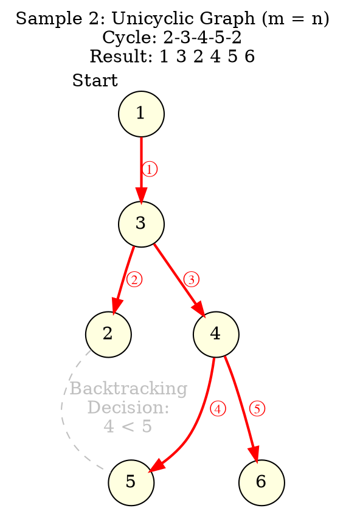
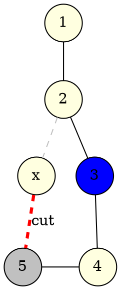
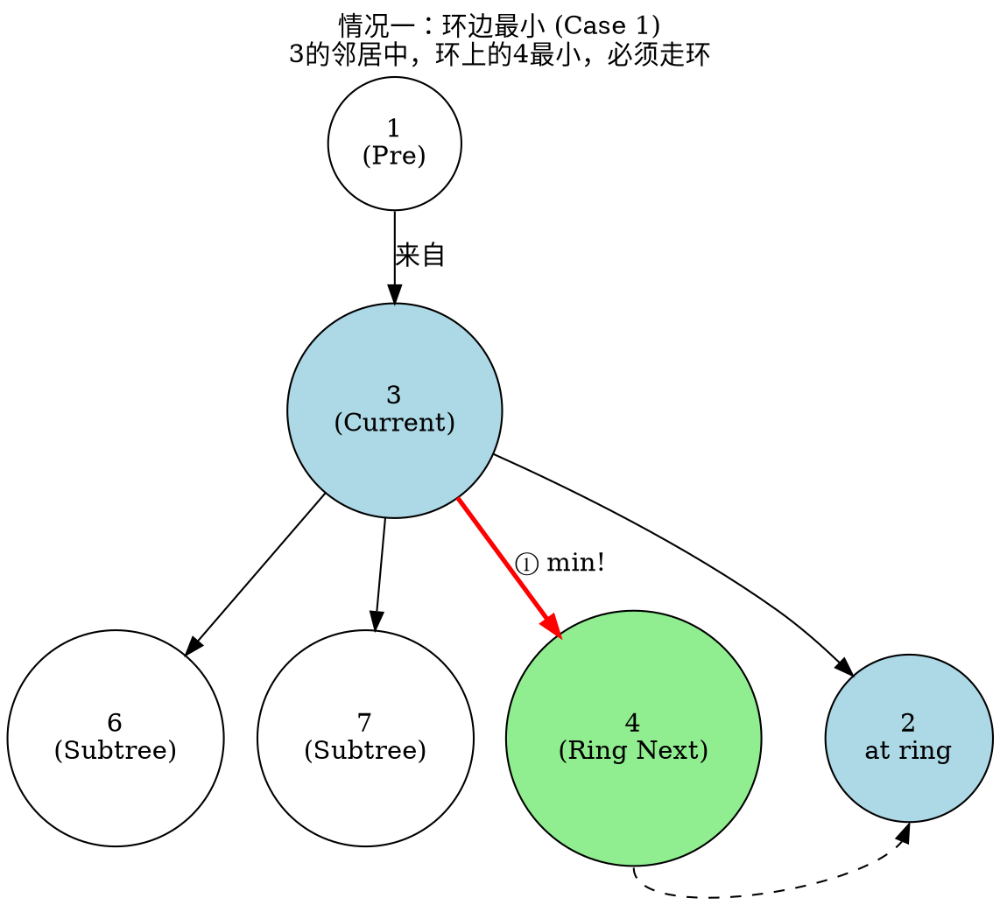
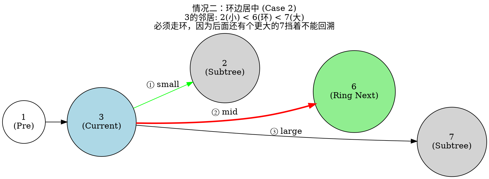
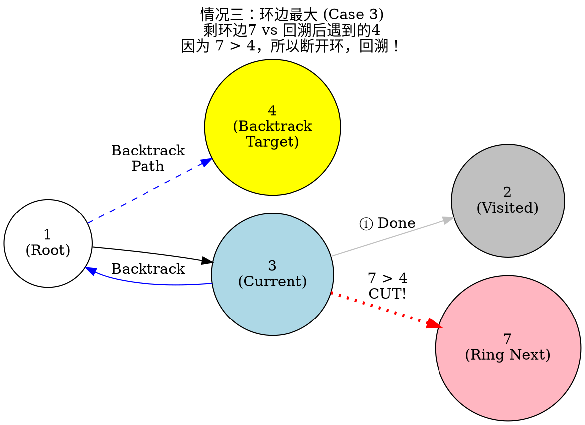

[[TOC]]

## 简单思考

回退旅行法一定最后是棵树, 一定有一个有个条边没有走

- 简单想法: 枚举端口环上的边
- 枚举超时,优化
    - 找性质 : 只有最环上的时候才可能决定回退(不走某条边)
    - 想到性质: 贪心
    - 分情况讨论 + 对拍

## 原版的代码

枚举环上的那条边不走,然后变成一个树,然后dfs

这个题目的$n^2$ 解法,参看 [[problem: luogu,P5022]]

## 题目解析

`n = 5e5`,也就是说我们不能删边那枚举: 

- **一定是根据某种规则,某种情况,某种条件,知道环上的那条边不走**,
- 构造数据,使用 $n^2$ 的代码进行对拍,不停的优化代码,就出来了


### 情况 0



根据样例,可以得知: 如果环上的下一个点 $5$, 比 dfs回溯 的环上的另外一个点 $4$ 大,就回溯,


> 最简单的情况, 环上没有子树, 显然 : 环上的下一个点,比回溯后的子树(环上的另一个点)大的时间,就断开这个边




## 思考

现在考虑如果环上的点有子树怎么办:

>[规则1] !!! 一个重要的规则: u 是环上的点, 如果 从 $u$ 回溯(也就是 `(u,v)`边是断开的,v也在环上) ,那么一定会把u的子树上的点 遍历完,才会回溯.

这份解析是基于你提供的博客图片（洛谷 P5049 题解）进行的详细重构。

这道题的难点在于 $m=n$ 的情况，也就是**基环树**。
基环树 = 树 + 1条边 = **含有一个环**。

### 核心策略

对于基环树，我们的策略是：**在环上找到一条边断开，使其变成一棵树，并且这条断开的边能让剩下的 DFS 序字典序最小。**

由于 $N$ 很大 ($5 \times 10^5$)，我们不能枚举断哪条边（那样是 $O(N^2)$）。我们需要在 DFS 遍历环的过程中，使用 $O(N)$ 的贪心策略**动态决定**是否断开当前环上的边。

当我们处于环上的某个点 $u$，准备走向环上的下一个点 $v$ 时，我们将 $v$ 与其他邻居的关系分为**三种情况**。

---

### 情况一：环上的边是当前“最优解” (Ring edge is the Smallest)

**描述**：
当我们到达环上节点 $u$ 时，它连接着若干个点。如果**环上的下一个点 $v$ 的编号**比 $u$ 所有其他未访问的邻居（子树节点）都要**小**。

**决策**：
根据贪心原则，为了字典序最小，我们**必须**立刻走环上的这条边 $(u, v)$。没有任何理由回溯或去别的点。

*   当前点：**3**
*   邻居：**4** (环上下一站), **6** (子树), **7** (子树)
*   比较：$4 < 6$ 且 $4 < 7$
*   **动作**：毫不犹豫，走 **4**。

> 因为如果要 断开 `E(3,4)`这个边, 那么根据 `[规则1]`, 那么 dfs序的这个位置就是 `6`, 显然不如 `4` 好 
> 
>  ^--反证法



---

### 情况二：环上的边是“中庸之选” (Ring edge is neither smallest nor largest)

**描述**：
在节点 $u$，环上的下一个点 $v$ **不是最小的，但也绝对不是最大的**。这意味着 $u$ 至少有一个比 $v$ 小的邻居（先走它），也至少有一个比 $v$ 大的邻居。

**决策**：
1. 先访问比 $v$ 小的邻居（显然）。
2. 轮到 $v$ 时，我们还剩下一个比 $v$ **大**的邻居 $w$ 等待访问。
3. **关键点**：由于 DFS 的性质，如果我们此时不走 $v$ 而选择回溯，我们并没有真的“离开”节点 $u$，因为还有一个更大的 $w$ 没访问呢！我们必须把 $u$ 的所有边处理完才能回溯给父亲。
4. 所以，摆在我们面前的只有两条路：先走 $v$ 还是先走 $w$。因为 $v < w$，贪心策略告诉我们：**继续走环，访问 $v$**。

**结论**：只要当前节点还有比环上边更大的子树节点，我们就不能回溯，必须走环。

*   当前点：**3**
*   邻居：**2** (子树), **6** (环上下一站), **7** (子树)
*   顺序：
    1. 先走 **2** (最小)。
    2. 剩下 **6** (环) 和 **7** (子树)。
    3. 必须走 **6**。因为如果想回溯，必须先处理完 **7**，但 $6 < 7$，所以先走 6。

> 还是根据 `[规则1]`, 如果断开边 `E(3,6)`,那么 dfs序的这个位置就是 `7`, 显然不如 `6` 好
> 
>  ^--反证法



---

### 情况三：环上的边是“最大/最后”的选择 (Ring edge is the Largest)

**描述**：
在节点 $u$，我们要么没有其他邻居了，要么其他邻居（子树节点）都比环上的点 $v$ 小，并且都已经访问完了。
现在只剩下：**走环上的点 $v$** 还是 **结束节点 $u$ 的访问并回溯**？

**决策**：
这是唯一可能“断开环”的地方。我们需要“向后看”。
假设我们**回溯**（即断开 $u \to v$），我们将会沿着树往回走。在回溯路径上，我们会遇到的**第一个未访问的节点**是多少？设这个值为 `Backtrack_Val` (代码中通常用一个变量维护)。

*   如果 **$v < \text{Backtrack\_Val}$**：
    走环更划算（字典序更小）。**继续走环**。
*   如果 **$v > \text{Backtrack\_Val}$**：
    回溯更划算。**断开环边 $(u,v)$，立刻回溯**。

#### Graphviz 图示：情况三
*   当前点：**3**
*   邻居：**2** (子树, 已访问), **7** (环上下一站)
*   回溯潜能：假设 1 号点还有个分支连着 **4**。
*   **比较**：
    *   选项 A：走环去 **7**。序列：`... 3 7 ...`
    *   选项 B：回溯去 **4**。序列：`... 3 (回溯) 4 ...`
*   **结果**：因为 $7 > 4$，我们选择 **断开** $3 \to 7$，回溯去找 4。



### 总结与代码对应

*   **情况一 & 二**：对应代码中 `dfs` 正常遍历部分。只要有比环边大的子树存在，或者环边本来就很小，就正常进。
*   **情况三**：对应代码中 `dfs` 里的特殊判断。
    *   代码逻辑：在进入环之前，会记录一个 `tmp`（或者叫 `min_future`），这个 `tmp` 是我们在之前的节点（比如父节点）放弃走的那个“稍大一点的子树节点”。
    *   当我们在环上走到只剩环边时，比较 `Ring_Node` 和 `tmp`。
    *   如果 `Ring_Node > tmp`，标记 `flag = true`（表示环已断开），并 `break`（不再走环边，回溯）。

这就是 $O(N)$ 解决基环树字典序最小问题的核心逻辑：**只在环边是当前节点最大选择，且比回溯后的“备胎”还要大时，才执行断边操作。**

> !!! 注意 ⚠️
> 
> 最终的代码, 根本不需要: **只在环边是当前节点最大选择，且比回溯后的“备胎”还要大时，才执行断边操作。**
> 因为这个条件太复杂
>
> 真时的代码上的使用条件: 环上的点 $u$ 的下一个点 $v$ ,比回溯备胎大的时候,就回溯

## 总结

一个考查细心程度的题目,想象力,画图能力

## 代码

## 参看

- [题解 P5049 【旅行（数据加强版）】 - 洛谷专栏](https://www.luogu.com.cn/article/1g2bdbj2)


这是一个非常好的尝试。你原来的代码使用的是 $O(N^2)$ 的暴力删边法（枚举每一条环上的边，删掉，然后跑一次 $O(N)$ 的 DFS），这对于 $N \le 5005$ 的普通版是可行的，但对于 **加强版 $N \le 500,000$** 肯定会超时 (TLE)。

为了通过加强版，我们需要使用 **$O(N)$ 的贪心策略**。

### 核心思路

我们不需要真的枚举删除每一条边。我们只需要在 **第一次 DFS 遍历** 的过程中，**动态地** 决定哪条边需要被“断开”。

根据刚才图片的解析，决策逻辑如下：

当我们在环上，从 $u$ 准备走向 $v$ 时：

1. 计算如果我们**不走** $v$（即回头），紧接着能访问到的最小点是谁？记为 `next_candidate`。
2. 如果 $v > next\_candidate$，说明现在的路不如回头的路，**断开 $(u, v)$**，并且把 `broken` 标记设为 `true`（之后不再进行断边判断）。
3. 否则，继续走 $v$。

### 修改后的代码 (C++)

为了适应 $500,000$ 的数据量，我做了一些必要的优化：

1. **数组大小**：改为 `500005`。
2. **邻接表**：去掉了 `edge` 结构体中的 `id`，因为 $O(N)$ 做法不需要边的 ID，只需要知道点是否在环上。
3. **流程**：
   - `init()`: 建图并排序。
   - `find_ring()`: 标记哪些点在环上 (`on_ring` 数组)。
   - `dfs()`: 一边遍历输出，一边进行贪心断边判断。

```cpp
/**
 * Author by Rainboy blog: https://rainboylv.com github : https://github.com/rainboylvx
 * Optimized for P5049 Travel Enhanced
 */
#include <bits/stdc++.h>
#include <vector>
using namespace std;

// 1. 数据范围必须开大到 500005
const int maxn = 500005; 

int n, m;
vector<int> adj[maxn]; // 邻接表，只需要存点即可
bool on_ring[maxn];    // 标记点是否在环上
int parent[maxn];      // 找环用的父节点记录
bool vis[maxn];        // 访问标记
bool found_loop = false; // 是否找到环的标记
bool broken = false;     // 标记是否已经执行过“断边”操作
vector<int> ans;         // 存储最终序列

void init() {
    cin >> n >> m;
    for (int i = 1; i <= m; ++i) {
        int u, v;
        cin >> u >> v;
        adj[u].push_back(v);
        adj[v].push_back(u);
    }
    // 关键：对邻接表排序，保证优先访问编号小的点
    for (int i = 1; i <= n; ++i) {
        sort(adj[i].begin(), adj[i].end());
    }
}

// 第一步：找环并标记 on_ring 数组
void get_ring_dfs(int u, int fa) {
    if (found_loop) return;
    vis[u] = true;
    parent[u] = fa;
    
    for (int v : adj[u]) {
        if (v == fa) continue;
        if (vis[v]) {
            // 找到返祖边，说明发现环了
            found_loop = true;
            int curr = u;
            while (curr != v) {
                on_ring[curr] = true;
                curr = parent[curr];
            }
            on_ring[v] = true; // 别忘了 v 也是环上的点
            return;
        }
        get_ring_dfs(v, u);
        if (found_loop) return;
    }
}

/**
 * 第二步：贪心 DFS
 * u: 当前节点
 * outside_target: 如果从 u 回溯（或者在 u 的所有子树遍历完后），
 * 紧接着会访问的那个“备胎”节点的值。
 */
void dfs(int u, int outside_target) {
    vis[u] = true;
    ans.push_back(u); // 记录路径

    int sz = adj[u].size();
    for (int i = 0; i < sz; ++i) {
        int v = adj[u][i];
        if (vis[v]) continue;

        // 计算 next_candidate (回溯后的最佳备胎)
        // 1. 如果 v 不是 u 的最后一个邻居，那么如果不走 v (或走完 v)，下一个备选是 adj[u][i+1]
        // 2. 如果 v 是 u 的最后一个邻居，那么就要看 u 的父亲传下来的 outside_target
        int next_candidate;
        if (i + 1 < sz) {
            next_candidate = adj[u][i+1];
        } else {
            next_candidate = outside_target;
        }

        // --- 核心贪心断边逻辑 ---
        // 1. 我们还没有断过边 (!broken)
        // 2. 这条边在环上 (on_ring[u] && on_ring[v])
        // 3. 走 v 导致的值 > 回头的最佳备选值 (v > next_candidate)
        if (!broken && on_ring[u] && on_ring[v] && v > next_candidate) {
            broken = true; // 标记断边：假装这条边不存在
            continue;      // 跳过 v，不再 dfs(v)，直接进入下一次循环或函数结束(回溯)
        }

        dfs(v, next_candidate);
    }
}

int main() {
    ios::sync_with_stdio(false); cin.tie(0);
    init();

    if (m == n - 1) {
        // 情况一：树，不需要找环，直接 DFS
        // 0x3f3f3f3f 是一个无穷大的数，表示没有回溯限制
        fill(vis, vis + n + 1, false);
        dfs(1, 0x3f3f3f3f);
    } else {
        // 情况二：基环树
        // 1. 先找环，标记 on_ring
        fill(vis, vis + n + 1, false);
        get_ring_dfs(1, 0);

        // 2. 清空 vis 数组，准备正式遍历
        fill(vis, vis + n + 1, false);
        
        // 3. 贪心 DFS
        dfs(1, 0x3f3f3f3f);
    }

    // 输出结果
    for (int i = 0; i < ans.size(); ++i) {
        cout << ans[i] << (i == ans.size() - 1 ? "" : " ");
    }
    cout << endl;

    return 0;
}
```

### 代码修改要点解析

1. **数据结构**：
   - 我将 `maxn` 增加到了 `500005`，防止数组越界。
   - 移除了 `adj` 中的 `id` 和 `del_edge` 变量，因为我们不是物理删除边，而是逻辑“跳过”。
2. **找环逻辑 (`get_ring_dfs`)**：
   - 你的原代码 `vis[u] = 2` 的思路是对的，但我换成了更通用的 `parent` 数组回溯法。
   - 当遇到 `vis[v] == true` 时，说明找到了环的闭合处，此时利用 `parent` 数组一路往回找，直到遇到 `v`，把路径上所有点标记为 `on_ring = true`。
3. **贪心 DFS (`dfs`)**：
   - 引入了 `outside_target` 参数。这是实现 $O(N)$ 算法的关键。它代表“如果不走当前这条路，或者走完这条路后，我们要去哪里”。
   - **断边判断**：`if (!broken && on_ring[u] && on_ring[v] && v > next_candidate)`。
     - 这行代码直接对应了图片解析中的 **情况三**。
     - 一旦触发，`broken = true`，并且 `continue`，相当于这辈子不再走 $u \to v$ 这条边了，实现了 $O(N)$ 复杂度的最优解查找。

## 代码 ver 1

此代码有bug

@include-code(./1.cpp,cpp)

使之错误的数据如下:

这个数据的构造逻辑是：利用你代码中 adj 包含父节点这一特性，构造一个场景，使得 父节点编号 > 环上的下一个节点编号，从而导致 last_v 判定失效，跳过了本该进行的“断边”判断。

```
5 5
1 5
5 2
5 3
5 4
2 4
```

这是一个 **$N=5$** 的精简数据，可以 100% 稳定卡掉你的代码。

你之前的测试之所以通过，是因为 $N=10$ 的数据有些巧合，或者你的代码在特定分支顺序下碰巧蒙对了。

但这个数据利用了 **`fa > v`** 的特性，构造了一个完美的陷阱。

### 1. 必杀 Hack 数据 (Input)

Plaintext

```
5 5
1 5
5 2
5 3
5 4
2 4
```

### 2. 结果对比

- **期望输出 (Correct Output)**:

  Plaintext

  ```
  1 5 2 3 4
  ```

  *(最优策略：在 2 处断开 2-4，回溯到 5，先走 3，最后走 4)*

- **你的代码输出 (Your Output)**:

  Plaintext

  ```
  1 5 2 4 3
  ```

  *(错误策略：没有断开 2-4，直接走了 4，导致第 4 位是 4，比正确答案的 3 大)*

------

### 3. 错误图解与深度分析

这个图的结构非常简单，但杀伤力极大。

**图结构**：

- **入口**：`1` 连接到枢纽 `5`。
- **枢纽 5**：连接了 `2`、`3`、`4`。
- **环路**：`5 - 2 - 4 - 5`。

**代码执行流程分析**：

1. **DFS(1)**：直接走向 `5`。
2. **DFS(5)**：
   - 邻居有 `2, 3, 4`（1 已访问）。
   - 按贪心顺序，先走最小的 **`2`**。
   - **回溯目标 (Target)**：如果在 `2` 处断边回溯，`5` 的下一个邻居是 **`3`**。
3. **事故现场：节点 2**
   - 当前节点 `u = 2`。
   - 父节点 `fa = 5`。
   - 环上邻居 `v = 4`。
   - **adj[2] 排序后**：`{4, 5}` （因为 `4 < 5`）。
4. **你的代码逻辑漏洞**：
   - 遍历到 `v = 4`。
   - 检查 `last_v`：`adj[2].back()` 是 `5` (父节点)。
   - `4 != 5`，所以 **`last_v` 为 `false`**。
   - **致命错误**：你的代码直接 `continue` 跳过了断边判断！
   - **正确逻辑**：应该比较 `v(4)` 和 `target(3)`。因为 `4 > 3`，应该**断开 2-4**。
5. **结局**：
   - **你的代码**：走了 `2 -> 4`。路径变成 `1-5-2-4...`，最后才访问 `3`。
   - **最优解**：断开 `2-4`，回溯到 5，走 `3`，再走 `4`。路径 `1-5-2-3-4`。

### 4. 最终修复建议

请彻底删除 `last_v`。只要是环上的边，就必须判断。


## 代码 ver 1.1

> 修复了 ver 1 的 环上的点是last(是父亲的最大的一个孩子), 但实际adj存储的里面含有fa 

> 不好的地方: 基环树 找环的代码 太复杂, 啰唆的on_ring_edge

@include-code(./1.1.cpp,cpp)


## 代码 ver 1.2

> 1. 去除啰唆的 on_ring_edge 
> 2. 简化了 find_loop
> 3. 添加详细的注释

@include-code(./1.3.cpp,cpp)
