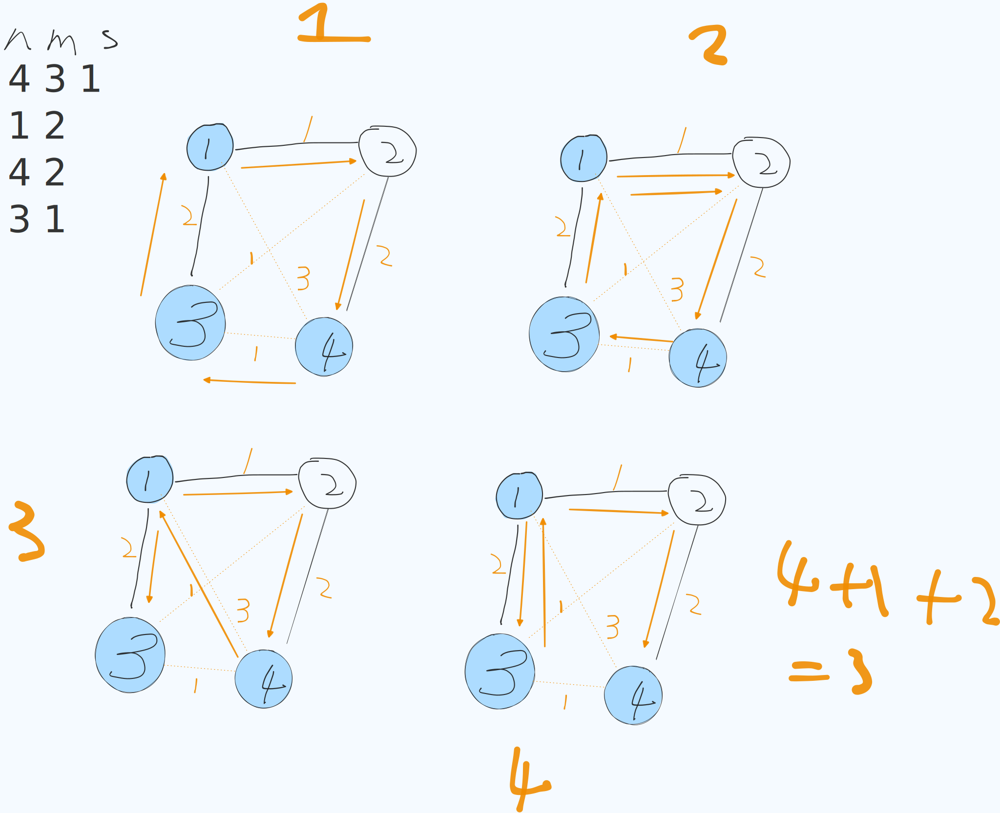

[[TOC]]

TODO: 理解题目,理解证明

## 样例图解 

## 题目解析

如果你看到一个大神在赛场上秒切了这道题，不是因为他现场推导出了欧拉路的性质，也不是因为他天赋异禀现场发明了 MST。

**真相是：他的大脑里存了几百个“模型”，这道题对他来说，只是把“模型 A”和“模型 B”拼在了一起。**

对于这道题，高手的思维路径是这样的（全是**条件反射**）：

1. **看到“必经每条边至少一次”** $\rightarrow$ **条件反射**：这是“中国邮递员问题”的变种，核心是**欧拉回路**。
2. **看到“可以重复经过”** $\rightarrow$ **条件反射**：重复经过 = 加边。
3. **看到“欧拉回路不存在”** $\rightarrow$ **条件反射**：欧拉回路两大铁律是**连通**和**度数**。我要去修补这两个条件。
4. **看到“数轴/线性结构”** $\rightarrow$ **条件反射**：线性的连通性通常和相邻节点有关。

**你之所以觉得是“从头推导”，是因为你的“工具箱”里还没有存放这些“条件反射”的触发器。**

## 思考1

> 我无法理解这个题目是如何从原始的题面上转移思考到 : 构造最小权值的欧拉路径, 我发现: 
> 1. 必经路是可以重复走的, 这和欧拉路 每条边 只能走一次,不是冲突吗?

> PS: 因为这儿题目是 中国邮递员问题的变种: 参考 [【刘田  集合论与图论】第30讲 中国邮递员问题、货郎问题_哔哩哔哩_bilibili](https://www.bilibili.com/video/BV1DisfzFETs/?vd_source=a16e7d60ec30d7ca460e723941be155c) 所有你可以先看, 中国邮递员问题 是如何 转换成的 欧拉路问题的
> 然后就涉及到欧拉路充要条件: 1. 度  2. 连通 

这是一个非常棒的、直击本质的疑问！

你说得很对：单纯的“欧拉路径”定义确实是每条边“恰好经过一次”。

而题目要求的是：必经边“至少经过一次”。

这看起来是矛盾的，但通过**图论建模**的视角，它们在本质上是统一的。我们来一步步拆解这个思维跃迁的过程。

### 1. 核心转换思维：“走两遍” 等价于 “加一条边”

在图论中，如果我们在一张图上行走，如果你需要重复经过某条边 $u \leftrightarrow v$，在数学模型上，这等价于：

在 $u$ 和 $v$ 之间，新增加了一条边（重边）。

- **物理动作**：你从 $u$ 走到 $v$（第1次），后来又从 $v$ 走到 $u$（第2次）。
- **数学模型**：图中存在两条边，一条是 $(u, v)_1$，另一条是 $(u, v)_2$。你的路径是先走 $(u, v)_1$，后走 $(u, v)_2$。

结论：

题目说的“必经路可以重复走”，转化到构造模型上，就是：我们可以向图中任意添加边（虚边），只要付出对应的代价 $|u-v|$。

于是问题变成了：

> 在原有的 $m$ 条必经边的基础上，**添加最少权值的额外边**，使得这个**新图（原边+加边）** 存在一条欧拉路径（一笔画）。
>
> 只要**新图**存在欧拉路径，我们沿着这条路径走，就自然满足了：
>
> 1. 所有必经边都走到了（因为它们在图里）。
> 2. 额外加的边也走到了（这代表我们在路上为了连通或赶路而走的路）。
> 3. 每条边（无论是必经的还是新加的）都“恰好”被走了一次。

------

### 2. 为什么一定是构造“欧拉路径”？

我们想求从 $S$ 出发到 $T$ 结束的最短路径，且必须经过某些边。这其实就是**一笔画问题**的变种。

试想，你把所有必须走的边画在纸上。现在你的笔在 $S$ 点。

你的任务是：必须画过所有黑色的线（必经边），笔不能离开纸面，最后停在 $T$ 点。为了做到这一点，你可以在纸上画一些红色的线（额外边/重复路）来连接断开的部分或跳跃位置。

为了让笔画不中断且总长度最短，最终画出来的图形（黑色+红色）必须满足**一笔画（欧拉路径）的充要条件**：

1. **连通性**：所有线条必须连在一起，不能有孤岛。（如果不连通，笔就必须提起来，飞过去，这在题目里意味着要走一段路过去，也就是加边）。
2. **度数（奇偶性）**：
   - 起点 $S$ 和 终点 $T$ 必须是“进出不平衡”的（度数为奇数）。
   - 中间所有点必须是“有进必有出”的（度数为偶数）。

所以，题目的解法就顺理成章地变成了：

如何用最小的代价（加边），把一个原本支离破碎、度数乱七八糟的图，修补成一个连通的、度数符合要求的欧拉图。

------

### 3. 解析“重复走”在算法中的体现

在我们的代码逻辑（以及木xx木大的解析）中，有两个步骤体现了“重复走/加边”的逻辑：

#### 第一步：修正奇偶性（Greedy）

当我们连接两个奇度点 $u, v$ 时，我们添加了一条边 $(u, v)$。

- **物理意义**：我们需要从 $u$ 走到 $v$（或者反过来），这一段路是**额外走的**。
- **对必经边的影响**：这段路可能覆盖了某些必经边，也可能是一条全新的空路。但在欧拉图模型里，它就是一条新边。

#### 第二步：修正连通性（MST）

当我们发现两个连通块不连通时，我们添加了一条边，且权值乘了 2。

- **物理意义**：我们需要从一个团走到另一个团，办完事还得回来（因为要保持度数偶数性质不变）。
- **这就是“重复走”的极致体现**：比如为了去连通远方的一个必经边，我必须走过去，再走回来。这在图中等价于加了两条重边（或者说一条往返边）。

### 4. 总结：思维导图

1. 原始需求：走完必经边，可以重复，求最短路。

   $\downarrow$

2. 建模转化：“重复走” = “加新边”。

   $\downarrow$

3. 目标重塑：构建一个包含“必经边”和“新边”的新图。

   $\downarrow$

4. 约束条件：为了能一气呵成走完（一笔画），新图必须满足欧拉路径条件（连通 + 奇偶）。

   $\downarrow$

5. **算法落地**：

   - 先补奇偶（成本最低，因为只加1条边）。
   - 再补连通（成本稍高，因为要往返，加2条边）。

一句话点醒梦中人：

欧拉路径要求每条边只走一次，是指最终构造出来的那个完美图里的每条边只走一次。而那个“完美图”里，包含了必经边（走一次）和我们额外添加的边（走一次，代表现实中的重复路或赶路）。

## 疑问

贪心算法原本的逻辑跑完，我们得到的是一个闭环（欧拉回路），而不是一条从 $S$ 到 $I$ 的路径。

1. 为什么一定求 欧拉路 ,欧拉回路 不可以吗?
2. 如果原来 的必走边,已经形成的欧拉回路, 然后添加 s ->i 的虚拟边, 变成奇数的度, 然后 贪心算法,就会添加一下边, 这样不久产生 额外的花费了吗?
3. 如果 s 与 i 是同一个点, 那不就是欧拉回路吗? 那么添加 虚拟的 s->i 的边 ,还正确吗

> 关于 $S, I$ 虚拟增加度数的三个核心疑问证明

**1. 为何必须求欧拉路径（非回路）？**

- **约束**：题目要求起点为 $S$，终点为 $i$。
- **证明**：若 $S \neq i$，欧拉回路性质决定必须回到起点 $S$，无法停在 $i$。仅当 $S, i$ 度数为奇，其余为偶（欧拉路径条件）时，才能保证一笔画路径终于 $i$。

**2. 原图若已连通，虚拟边导致的加边是否为“冤枉钱”？**

- **否，这是必要代价**。
- **证明**：若原必经边构成回路（$S \to \dots \to S$），任务却要求停在 $i$。虚拟操作 `deg[S]++, deg[i]++` 制造了奇点，迫使贪心算法添加一条实边 $(S, i)$。
- **物理意义**：代表在走完回路回到 $S$ 后，必须再走最短路到达终点 $i$。该花费是满足边界条件的**最小必要开销**。

**3. 若 $S=i$，虚拟加边逻辑是否崩塌？**

- **否，逻辑自洽**。
- **证明**：操作等价于 `deg[S] += 2`。根据同余性质 $x + 2 \equiv x \pmod 2$，**度数奇偶性不变**。
- **结论**：算法对此情况会完全忽略（或保持原有的配对逻辑），自动兼容欧拉回路求解，无需特判。

## 代码 

@include-code(./1.cpp, cpp)

## 参考:

- [【题解】丁香之路 - 洛谷专栏](https://www.luogu.com.cn/article/4rq9rc43)
