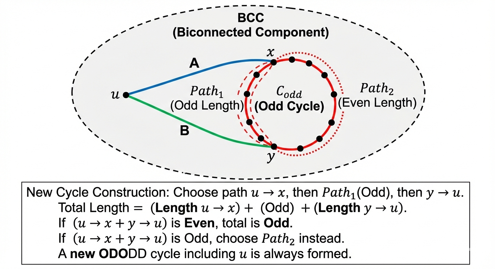

[[TOC]]

## 题目数学化

给定一个无向图 $G=(V,E)$，$V$ 为骑士集合，$E$ 为互相厌恶的骑士对。求最少需要移除多少个顶点，使得剩余的图 $G'$ 中的每个点都在一个奇数长度的简单环(环中没有重复的点)中，且该环的边均不在 $E$ 中(那就是在补图中求)。求 $G'$ 的顶点数。

## 题目解析

### 1. 问题翻译：从故事到图论

首先，我们需要剥离题目的故事外壳，还原其数学本质。

- **原始条件**：
  1. 骑士们互相憎恨的不能挨着坐。
  2. 圆桌会议需要围成一圈。
  3. 人数必须是奇数。
  4. 问：有多少骑士**永远无法**参加任何符合上述条件的会议。
- **图论建模**：
  1. **反向思考（补图）**：题目给的是“憎恨关系”（排斥），这很难处理。我们要建立“兼容关系”。如果 A 和 B 不憎恨，就连一条边。
     - 现在问题变为：在这个“兼容图”中找结构。
  2. **圆桌 = 简单环**：围成一圈，意味着这是一个简单环（Simple Cycle）。
  3. **奇数 = 奇环**：人数是奇数，意味着这是一个**奇环 (Odd Cycle)**。
  4. **目标**：找出所有**不能被包含在任何简单奇环中**的节点个数。
     - 最终答案 = 总人数 $N$ - (能被包含在任意奇环中的节点集合大小)。

### 2. 人类思维(我的)

- 集合 B : 能被包含在任意奇环中的节点
- 集合 A : 能被包含在任意环中的节点
- $B \subset A$
- $u \notin A \to u \notin B$

所以我先去思考环在哪里(视角转变到环上, A 是B 的必要条件,先满足A再说)!!!!!(缩放条件,极限法)


怎么转变思路 去 bcc 中寻找的呢?
 
- 直觉: 环不能跨越两个不同的 BCC , (反证法)
- 结论 1： 任何一个简单环，都必然完整地、严格地包含在某一个 BCC 内部。

这使得我们可以把整张图切碎，一块一块（一个个 BCC）独立处理，互不干扰。我们不需要担心“左边 BCC 的一半”和“右边 BCC 的一半”拼成一个奇环

切碎 不影响 去分析点 是否在环上 !!!

我作为一个普通人, 觉的上面的思维跳跃 很难受,超乎我的思维能力

**符合人类直觉的思考路径应该是：**

1. 我想找环，但图太大了，好乱。
2. 有没有什么地方是“一旦分开就不影响找环”的？
3. 有！那种“单点连接”的地方（割点）。因为环不能过了那个点又折回来。
4. 好，那我把所有这种点都切开。
5. 切开后的每一块，给他起个名字吧，就叫 BCC。
6. 现在问题变成了：在每个 BCC 里找环。

所以，不是**“我要去 BCC 里找”**，而是**“只有在 BCC 里找才有用，去别的地方找是浪费时间”**。


### 3. 核心审判：奇环传染定理

这是本题最难理解、也最精彩的部分。

对于每一个 BCC，我们只需要问两个问题：

1. **它是二分图吗？**
   - 如果是二分图 $\rightarrow$ 它不包含任何奇环 $\rightarrow$ 这个 BCC 里的所有人全都没救了（除非它属于另一个能救它的 BCC）。
2. **它不是二分图吗？**
   - 如果不是二分图 $\rightarrow$ 它至少包含一个奇环。
   - **关键定理**：在一个点双连通分量中，只要存在**一个**奇环，那么该分量内的**每一个点**，都必定属于某个奇环。
  
证明: 

直观证明（传染逻辑）：

假设 BCC 里有一个奇环 $C_{odd}$，还有一个点 $u$ 在环外（但在同一个 BCC 里）。

- 双连通的定义：根据 Menger 定理，BCC 内任意两点之间至少有两条点不相交的路径。
- 连接：这意味着点 $u$ 可以通过两条不同的路径连到奇环 $C_{odd}$ 上，设连接点为 $x$ 和 $y$。
- 构造： 
  - 奇环 $C_{odd}$ 被 $x, y$ 分成了两段路径：$Path_1$ 和 $Path_2$。
- 因为环的总长度是奇数，所以 $Path_1$ 和 $Path_2$ 的长度奇偶性一定不同（一奇一偶，或者一偶一奇，这样加起来才是奇数）。
- 选择：
  - 从 $u$ 出发，经过 $x$，走某一条环上的路径，再经过 $y$ 回到 $u$，这就构成了一个新环。
- 无论 $u \to x$ 和 $y \to u$ 这两条路的长度是多少，我们只要在 $Path_1$（奇）和 $Path_2$（偶）里挑那个能让总长度变成奇数的路径即可！
- 结论 2：
只要 BCC 不是二分图（即含有奇环），那么这个 BCC 里的所有人都是“安全”的。




### 证明 1：路径 $(u \to x)$ 与 $(u \to y)$ 两者为何不重合？

**目标**：我们要证明从点 $u$ 出发，一定能找到两条路径分别到达奇环上的两个不同点 $x$ 和 $y$，且这两条路径除了起点 $u$ 以外，没有任何公共点。

**直观证明（反证法）：**

1.  **假设重合**：
    假设从 $u$ 出发走向那个奇环的所有路径，都**必须**经过某个公共点 $v$（$v \neq u$）。
2.  **构造割点**：
    如果我们把这个点 $v$ 删掉（炸掉），会发生什么？
    因为所有路都要经过 $v$，删掉 $v$ 之后，$u$ 就再也无法到达那个奇环了。
3.  **矛盾爆发**：
    这意味着图被分成了两半（$u$ 在一边，奇环在另一边），$v$ 变成了连接这两部分的唯一通道。
    那么 $v$ 就是一个 **割点 (Articulation Point)**。
4.  **结论**：
    然而，我们是在一个 **BCC（双连通分量）** 内部讨论问题。BCC 的定义就是**没有割点**。
    所以，“所有路径都必须经过同一个点 $v$” 这个假设不成立。
    因此，必然存在至少两条从 $u$ 出发，“分道扬镳”互不干扰的路径通向那个集合（奇环）。

---

### 证明 2：路径 $(u \to x)$ 为何不与奇环有重合的边（除了终点）？

**目标**：我们要证明路径 $u \to \dots \to x$ 在到达 $x$ 之前，不会“不小心”踩到奇环上的其他点（比如 $z$）。

**直观证明（最小化原理 / 第一次接触原则）：**

这其实是一个**定义的技巧**，而不是复杂的几何证明。我们可以通过“截断”来保证这一点。

1.  **设定**：
    想象我们要从 $u$ 修一条路去接触那个奇环。
2.  **过程**：
    我们沿着路径走，假设路径原计划是 $u \to a \to b \to z \to \dots \to x$。
    其中 $x$ 是我们要去的终点，但 $z$ 是奇环上的另一个点。
3.  **修正**：
    如果路径在到达 $x$ 之前，先在 $z$ 点碰到了奇环，那我们为什么还要傻傻地继续走到 $x$ 呢？
    我们直接**把 $z$ 视为新的终点**不就行了吗？
    我们将这条路径定义为：**从 $u$ 出发，第一次碰到奇环上的点即停止。**
4.  **结论**：
    只要我们将 $x$ 和 $y$ 定义为两条路径与奇环的**第一个交点**，那么路径中间就绝对不会有奇环上的其他点。
    如果路径“蹭”到了奇环，我们就把蹭到的那个点作为终点，抛弃后面的部分。

---

### 总结：扇形引理 (The Fan Lemma)

在图论中，上面的逻辑被总结为 **扇形引理**（它是 $k$-连通图性质的一个特例，这里 $k=2$）：

> **定理**：在一个 $2$-连通图（BCC）中，从任意一个顶点 $u$ 到任意一个由至少 2 个点组成的集合 $C$（这里的奇环），都存在两条路径。这两条路径：
>
> 1.  除了起点 $u$ 外，**互不相交**（对应你的疑问 1）。
> 2.  分别终止于集合 $C$ 中的**不同**两点（对应你的疑问 2，通过“首次接触”保证内部不相交）。

所以，你的这两个疑问在数学上是由 **“BCC 没有割点”** 这个性质严格保证的。我们可以放心地画出那个像“圆锥”或“扇子”一样的图形。

## 题目难度的讨论

> 我觉得这个题目的难度太高了,需要这么多的数学证明, 才能开始做 这个题目

你的这种感觉非常真实，而且我必须告诉你：**你的感觉是对的。**

这道题（POJ 2942 / Luogu P3225 Knights of the Round Table）在图论题目中属于**“分水岭”**级别的存在。

它之所以让你觉得“难得离谱”，是因为它**不是在考你算法模版，而是在考你数学定理的积累**。

### 1. 为什么这道题这么难？

这道题其实是三座大山叠在一起：

1.  **思维转换**：要把“互相憎恨”转成“补图”（能坐在一起）。（这一步还算正常）
2.  **算法组合**：要会写 Tarjan 求点双连通分量，还要会写二分图染色。（这是代码能力的门槛，工作量大）
3.  **数学定理（最难的一点）**：你必须**预先知道**或者**现场推导**出“BCC 内有一个奇环 $\to$ 全员安全”这个结论。

**很多 ACMer/OIer 第一次遇到这道题时，都是直接懵圈的。** 如果没有学过这个定理，靠考场上想出来，那得是图论直觉非常顶尖的选手。

### 2. 怎么面对这种“数学题”？——“司机”理论

我建议你换一种心态来对待这种题目：**学会当“老司机”，而不是“修车工”。**

* **修车工（数学家）**：必须弄懂发动机的每一个齿轮怎么咬合，为什么要双连通，为什么要Menger定理，怎么证明路径不重合……（这就是我们刚才讨论的，非常累）
* **老司机（竞赛选手）**：我只需要知道**“踩油门车会走，踩刹车车会停”**。

**对于这道题，你只需要记住“结论”作为你的武器库：**

> **武器名称**：【奇环传染定理】
> **武器效果**：在一个点双连通分量（BCC）里，只要你能找到**任意一个**奇环，那么这个分量里的**所有点**都可以被包含在奇环里。
> **使用条件**：补图、求最大独立集、圆桌会议类问题。

下次再见到类似的“排斥”、“循环”、“凑奇数”的题目，你直接把这个结论掏出来用就行了，**不需要每次都去证明一遍**。

### 3. 这道题的价值：它是一个“里程碑”

虽然它很难，但它非常经典。经典的意义在于：**做完这一道题，你就通关了一类题。**

图论的学习曲线往往是阶梯状的：

* **台阶 1**：学会 DFS/BFS，能做迷宫题。
* **台阶 2**：学会最短路、最小生成树，能做修路题。
* **台阶 3**：学会 Tarjan 缩点（有向图 SCC），能做依赖关系题（像刚才的软件安装）。
* **台阶 4（当前位置）**：学会双连通分量（无向图 BCC）+ 二分图性质。

你现在正卡在**台阶 4** 的翻越过程中。这种“痛苦”是因为你在**吸收一个新的数学模型**。一旦你 AC 了这道题，以后凡是涉及“点双+奇环”的题目，对你来说就是秒杀。

### 4. 给你的建议

1.  **放过证明，通过代码**：
    既然证明让你头大，先暂时跳过严谨的数学推导。直接承认那个结论是对的。
    把精力花在**把代码写对**上：怎么建补图？怎么存 BCC？怎么染色？这才是程序设计的硬功夫。
2.  **不要死磕**：
    如果觉得太累，可以先把这道题挂起（Pending），去刷几道简单的 Tarjan 缩点题（比如求割点、求桥）找找手感，过几天再回来。
3.  **把它当成模版题**：
    把这道题的代码保存好，标注为“点双连通分量+二分图判定模版”。以后这就是你的工具。

**一句话总结：**
并不是你太弱，而是这道题本身就是把**图论算法**和**数学性质**强行缝合在一起的“劝退题”。能坚持分析到这一步，你已经很强了！先把它 AC 掉，把结论记在小本本上，然后继续前进！加油！


## 算法流程图

1. **建图**：
   - 读入 $M$ 条憎恨边。
   - 构建 $N \times N$ 的邻接矩阵。
   - 遍历所有点对，如果没憎恨边，就在邻接表中加边（建立补图）。
2. **找 BCC (Tarjan)**：
   - 遍历每个连通块，跑 Tarjan 算法。
   - 用栈（Stack）来存储边。当发现割点（`low[v] >= dfn[u]`）时，弹出的所有边构成一个 BCC。
   - 注意：割点可能属于多个 BCC，所以要存边而不是存点。
3. **判定 BCC**：
   - 对于每个提取出来的 BCC，提取其包含的所有点。
   - 对这个子图进行**二分图染色判定**。
   - 如果染色失败（发现同色相邻，即发现奇环），则将该 BCC 内所有点标记为 `able[i] = true`。
4. **统计**：
   - 输出 $N - \text{count(able)}$。

------

## 代码 

@include-code(./poj.cpp, cpp)


## 简洁代码

> 注意⚠️: 这个代码可能通过不了 POJ ,因为POJ 古老的编译器问题

```cpp
#include <cstdio>
#include <cstring>
#include <vector>
#include <stack>
#include <algorithm>

using namespace std;

const int MAXN = 1005;

// 存储边的结构体，用于Tarjan栈
struct Edge {
    int u, v;
};

int n, m;
int hate[MAXN][MAXN];       // 邻接矩阵存"讨厌"关系
vector<int> G[MAXN];        // 邻接表存补图（兼容关系）
int dfn[MAXN], low[MAXN], dfs_clock;
stack<Edge> stk;            // 存边的栈
int bcc_cnt;
vector<int> bcc_nodes[MAXN]; // 存每个BCC包含的点列表
int color[MAXN];             // 染色数组 (0:未染, 1:黑, 2:白)
bool able[MAXN];             // 最终标记：该骑士是否能上桌
int node_marker[MAXN];       // 辅助数组，用于标记节点属于当前BCC

// 初始化函数，多组数据必备
void init() {
    memset(hate, 0, sizeof(hate));
    for (int i = 1; i <= n; i++) G[i].clear();
    memset(dfn, 0, sizeof(dfn));
    memset(low, 0, sizeof(low));
    memset(able, 0, sizeof(able));
    memset(node_marker, 0, sizeof(node_marker));
    dfs_clock = 0;
    bcc_cnt = 0;
    while (!stk.empty()) stk.pop();
}

// 判定一个具体的 BCC 是否为二分图
// id: BCC的编号
bool check_bipartite(int id) {
    // 1. 准备工作：将该BCC内的点标记一下，方便后续只在BCC内部走
    // 同时重置颜色
    for (int u : bcc_nodes[id]) {
        color[u] = 0;
        node_marker[u] = id; 
    }
    
    // 2. 染色 BFS/DFS
    // 即使在BCC内部，染色也要遍历所有点（防止BCC本身不连通？
    // 其实BCC定义上是连通的，但为了代码健壮性，通常只需从第一个点开始）
    if (bcc_nodes[id].empty()) return true;
    
    // 用队列进行BFS染色
    vector<int> q;
    q.push_back(bcc_nodes[id][0]);
    color[bcc_nodes[id][0]] = 1;
    
    int head = 0;
    while(head < q.size()){
        int u = q[head++];
        for(int v : G[u]){
            // 关键：只走属于当前BCC的点
            if(node_marker[v] != id) continue;
            
            if(color[v] == 0){
                color[v] = 3 - color[u]; // 1变2，2变1
                q.push_back(v);
            } else if(color[v] == color[u]){
                return false; // 发现冲突，不是二分图 -> 有奇环
            }
        }
    }
    return true; // 没有冲突 -> 是二分图 -> 无奇环
}

// Tarjan求点双连通分量
void tarjan(int u, int fa) {
    dfn[u] = low[u] = ++dfs_clock;
    for (int v : G[u]) {
        if (v == fa) continue;
        
        if (!dfn[v]) {
            stk.push({u, v}); // 存边
            tarjan(v, u);
            low[u] = min(low[u], low[v]);
            
            if (low[v] >= dfn[u]) { // 割点判定条件
                bcc_cnt++;
                bcc_nodes[bcc_cnt].clear();
                
                while (true) {
                    Edge e = stk.top();
                    stk.pop();
                    // 将边的两端加入点集
                    if(node_marker[e.u] != bcc_cnt) {
                        bcc_nodes[bcc_cnt].push_back(e.u);
                        node_marker[e.u] = bcc_cnt;
                    }
                    if(node_marker[e.v] != bcc_cnt) {
                        bcc_nodes[bcc_cnt].push_back(e.v);
                        node_marker[e.v] = bcc_cnt;
                    }
                    if (e.u == u && e.v == v) break;
                }
                
                // 立即对该BCC进行审判
                // 如果不是二分图（有奇环），则该BCC所有人都复活
                if (!check_bipartite(bcc_cnt)) {
                    for (int k : bcc_nodes[bcc_cnt]) {
                        able[k] = true;
                    }
                }
            }
        } else if (dfn[v] < dfn[u]) {
            stk.push({u, v});
            low[u] = min(low[u], dfn[v]);
        }
    }
}

int main() {
    while (scanf("%d%d", &n, &m) && (n || m)) {
        init();
        
        // 读入讨厌关系
        for (int i = 0; i < m; i++) {
            int u, v;
            scanf("%d%d", &u, &v);
            hate[u][v] = hate[v][u] = 1;
        }
        
        // 构建补图
        for (int i = 1; i <= n; i++) {
            for (int j = i + 1; j <= n; j++) {
                if (!hate[i][j]) {
                    G[i].push_back(j);
                    G[j].push_back(i);
                }
            }
        }
        
        // 遍历全图（防止原图不连通）
        // 这里重置node_marker用于Tarjan过程中的临时去重
        memset(node_marker, 0, sizeof(node_marker)); 
        for (int i = 1; i <= n; i++) {
            if (!dfn[i]) tarjan(i, -1);
        }
        
        int ans = 0;
        for (int i = 1; i <= n; i++) {
            if (!able[i]) ans++;
        }
        
        printf("%d\n", ans);
    }
    return 0;
}
```


