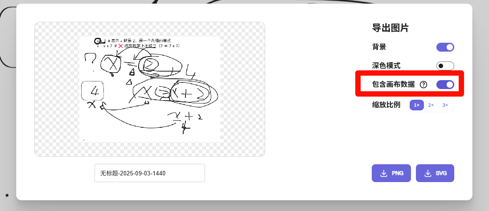

使用要求:


添加到nginx配置文件中, 实现CORS跨域 ,如下: 

```conf
# CORS-START 跨域访问配置
    # Add CORS headers if the $cors_origin variable is not empty
    add_header 'Access-Control-Allow-Origin' * always;
    add_header 'Access-Control-Allow-Methods' 'GET, POST, OPTIONS, PUT, DELETE' always;
    add_header 'Access-Control-Allow-Headers' 'DNT,User-Agent,X-Requested-With,If-Modified-Since,Cache-Control,Content-Type,Range,Authorization' always;
    add_header 'Access-Control-Expose-Headers' 'Content-Length,Content-Range' always;
    add_header 'Access-Control-Allow-Credentials' 'true' always;

    # Handle pre-flight OPTIONS requests
    if ($request_method = 'OPTIONS') {
        # Nginx will automatically add the headers above because of the 'always' flag
        return 204;
    }
# CORS-END
```